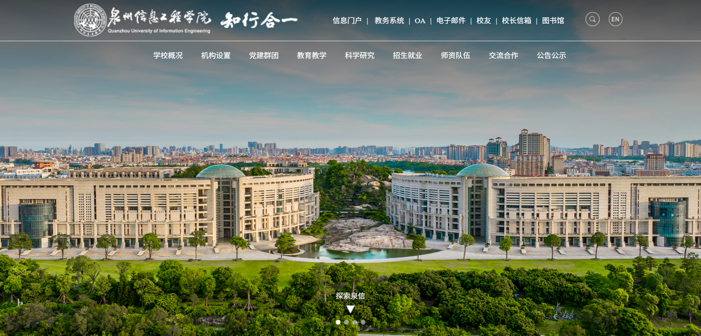
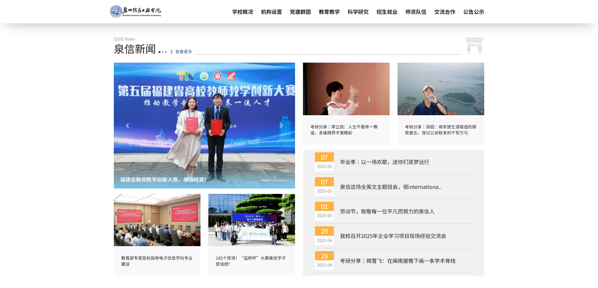
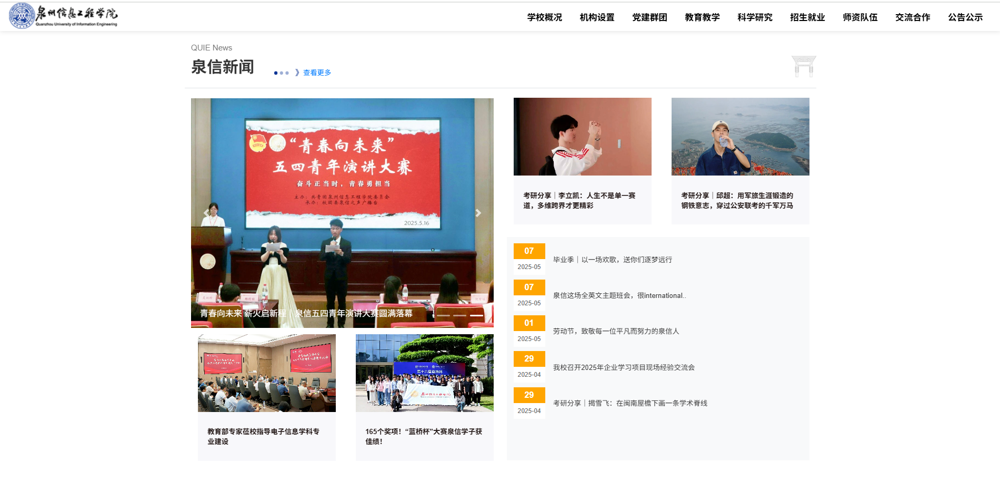
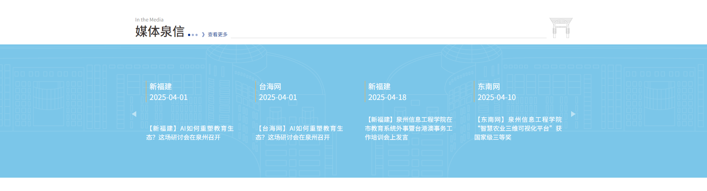
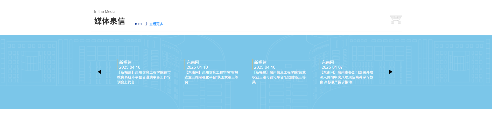

# 假的新版泉州信息工程学院官网

又到了写期末作业的时候了，本来想把去年用前端三件套仿写的拿来改改交上去得了。结果发现学校官网改版了，~~看来是种树的钱有了结余~~

看来我也只能重写一份了：使用探测器分析得知本次学校官网改版使用了AOS动画库，但是框架位置（据我所知他们喜欢用React），以及私有的轮播图组件（有点像elementplus的，但样式不一样）

本项目使用Vite+Vue3构建，部分动效依赖AOS动画库。

下面看看效果：
原网页（首页轮播图）：

仿网页（首页轮播图）：

原网页（泉信新闻）：

仿网页（泉信新闻）：

原网页（媒体泉信）：

仿网页（媒体泉信）：

其余组件不再赘述，总之就是尽量把学校官网抄了一份